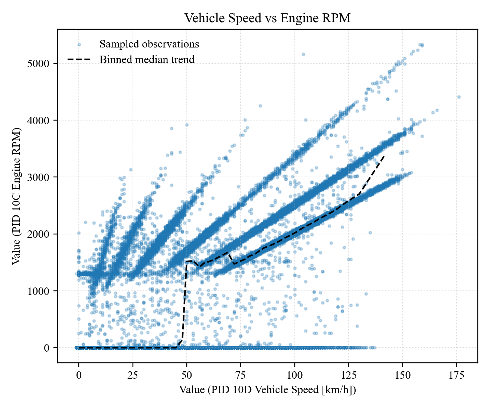
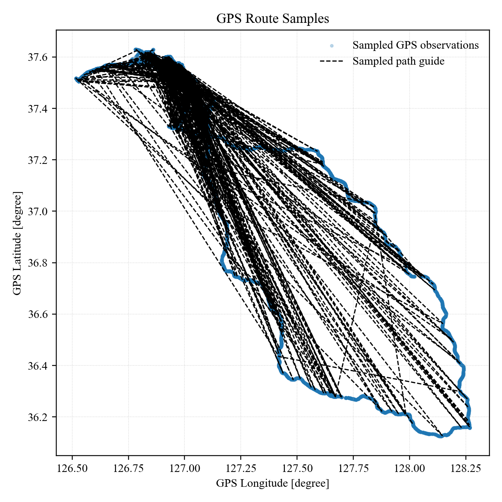
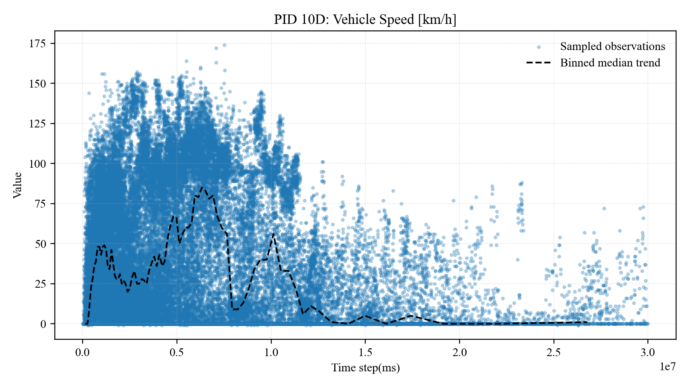
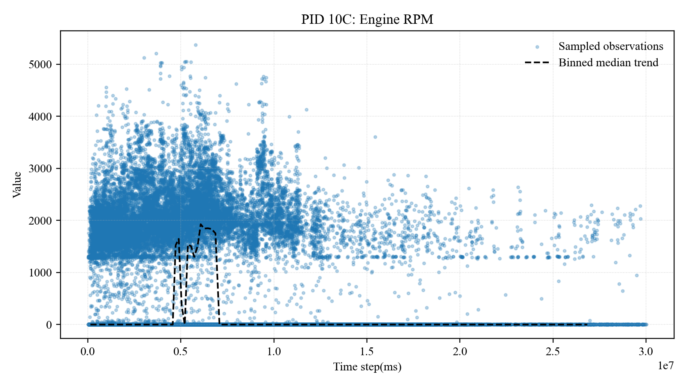

# OBD Dataset Analysis

This repository organizes, analyzes, and visualizes vehicle driving logs collected from an OBD/GPS/accelerometer logger. The raw files are preserved under `data/`, the reproducible analysis code is under `code/`, and generated tables and figures are under `results/`.

## Dataset Overview

The dataset contains time-series records from multiple vehicles and driving routes. Each CSV row follows a three-field structure:

| Column | Description |
| --- | --- |
| `Time step(ms)` | Elapsed logger time after startup, in milliseconds |
| `PID` | OBD, sensor, or GPS item identifier |
| `Value` | Recorded value for the corresponding PID |

The repository includes 168 CSV log files, 5 DOCX technical documents, and 1 XLSX output-definition file. The parsed analysis covers 28,468,179 valid CSV rows. Some logs contain corrupted bytes or malformed rows; these rows are not modified in the raw files, but they are excluded from the numeric summaries and counted separately as `bad_rows`.

## Repository Structure

```text
.
|-- code/
|   `-- main.py
|-- data/
|   |-- original technical documents/
|   `-- original OBD dataset files/
|-- results/
|   |-- figures/
|   |-- dataset_inventory.csv
|   |-- file_summary.csv
|   |-- pid_counts.csv
|   |-- pid_summary.csv
|   `-- route_summary.csv
`-- README.md
```

## Main PID Fields

| PID | Description | Rows |
| --- | --- | ---: |
| `20` | Acceleration x; y; z | 2,049,282 |
| `10D` | Vehicle Speed [km/h] | 2,049,273 |
| `10C` | Engine RPM | 2,049,242 |
| `11F` | Runtime since engine start [s] | 2,049,223 |
| `12F` | Fuel level input [%] | 2,049,211 |
| `146` | Ambient temperature [C] | 2,049,209 |
| `149` | Acceleration pedal position D [%] | 2,049,179 |
| `14A` | Acceleration pedal position E [%] | 2,049,173 |
| `A` | GPS Latitude [degree] | 2,011,915 |
| `B` | GPS Longitude [degree] | 2,011,896 |

The core analysis focuses on vehicle speed, engine RPM, engine runtime, fuel level, ambient temperature, acceleration pedal position, and GPS position. `PID 20` stores acceleration as a compound `x;y;z` value, so it should be split into separate axes before detailed numeric analysis.

## Figure Guide

All figures use scatter points plus a dashed black auxiliary line. For non-GPS plots, the dashed black line is a binned median trend: the sampled points are divided into ordered bins along the x-axis, and the median x/y value of each bin is connected. It is meant to summarize the central tendency of dense scatter points, not to represent a fitted regression model.

For the GPS plot, the dashed black line is a sampled path guide connecting a reduced set of GPS points. It is only a visual aid for route continuity and should not be interpreted as a map-matched route.

All figures use Times New Roman font settings. Axis labels follow the original column names or PID-based variable names.

### Vehicle Speed vs Engine RPM

This figure compares vehicle speed (`PID 10D`) with engine RPM (`PID 10C`). It highlights repeated driving regimes, including idle/low-speed behavior and RPM increases as speed rises. The dashed black line shows the binned median trend across speed bins.



### GPS Route Samples

This figure uses GPS latitude (`PID A`) and longitude (`PID B`) to show the spatial distribution of sampled driving locations. The dashed black line is a sampled path guide, not a calibrated road-network trace.



### Vehicle Speed over Time

This figure shows vehicle speed (`PID 10D`) over logger elapsed time (`Time step(ms)`). It helps identify stop-and-go driving intervals, high-speed intervals, and the overall speed distribution through time. The dashed black line shows the binned median speed trend.



### Engine RPM over Time

This figure shows engine RPM (`PID 10C`) over logger elapsed time (`Time step(ms)`). It can be compared with the speed plot to inspect how engine response changes during different driving states. The dashed black line shows the binned median RPM trend.



## Generated Result Tables

| File | Description |
| --- | --- |
| `results/dataset_inventory.csv` | Inventory of all files, extensions, and file sizes |
| `results/file_summary.csv` | Row counts and parsing-quality counts for each CSV file |
| `results/route_summary.csv` | Summary by date, route, and vehicle |
| `results/pid_counts.csv` | PID frequency table |
| `results/pid_summary.csv` | Mean, standard deviation, minimum, and maximum for numeric PID values |

The route summary contains 51 date/route/vehicle combinations. The `OBD_Data_1120 / Route1 / Vehicle4` segment contains 169,300 malformed rows, which are recorded in `bad_rows`.

## Reproduce the Analysis

The script requires Python with `pandas`, `matplotlib`, and `openpyxl`.

```powershell
python code/main.py --data-dir data --results-dir results
```

Running the script does not modify the raw files. It regenerates the CSV summary tables in `results/` and the figures in `results/figures/`.
